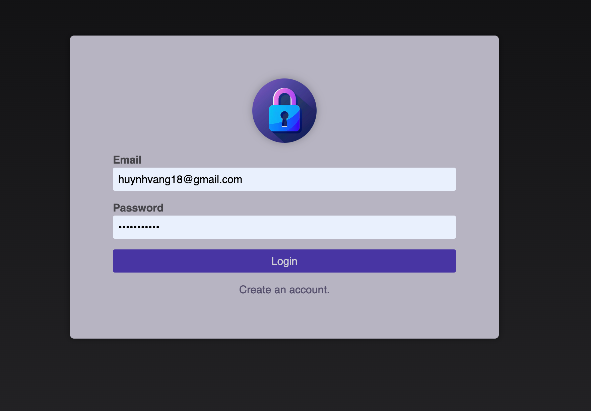
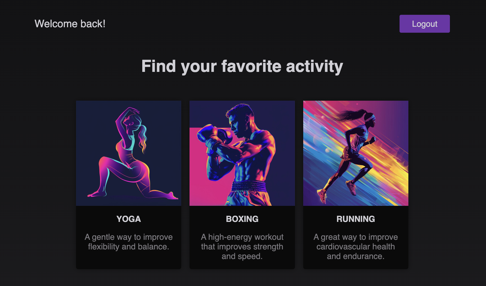

# Nextjs App for authentication with user name and password

- Using sql lite to store information
- Hashing pass before store into sql lite DB
- Create auth session using lucia and store session data into sql lite DB

